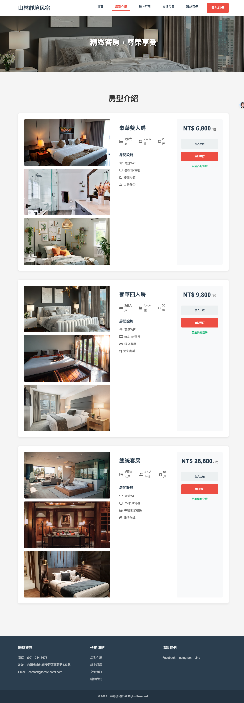
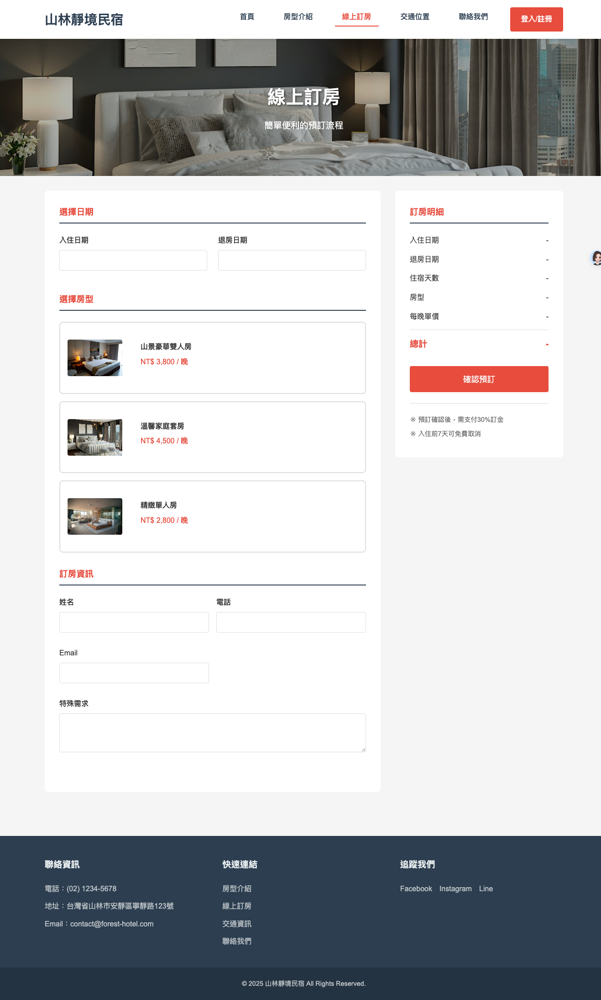
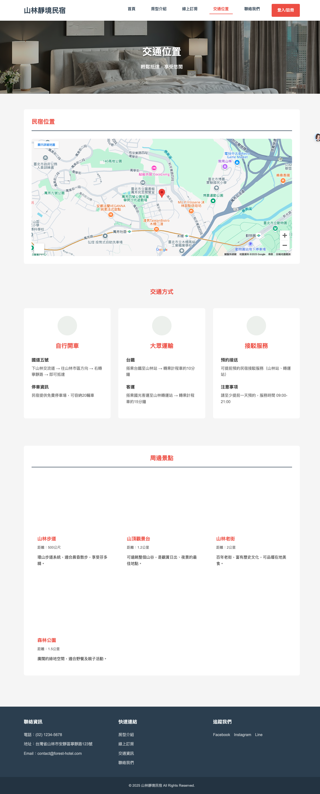
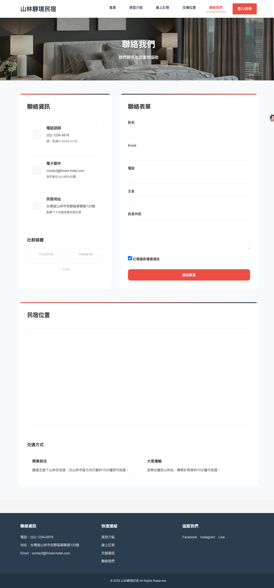

# Traditional Taiwanese B&B Website

[View in English](#english) | [觀看中文版本](#中文)

## Website Preview 網站預覽

### Homepage 首頁


### Room Preview 房型預覽



### Guest Reviews 旅客評價


---

# [English]

> Note: English is the primary language for issues and pull requests.

## Project Overview

A responsive website for a traditional Taiwanese B&B (bed and breakfast), featuring room booking, member management, and location information. The website provides an intuitive interface for guests to explore room options, make reservations, and contact the establishment.

## Screenshots

### Booking System



### Location Information



### Contact Form



## Installation

1. Clone the repository

```bash
git clone https://github.com/yourusername/traditional-bb-website.git
```

2. No additional installation required as this is a static website
3. Open `index.html` in your web browser

## Usage

The website can be accessed through any modern web browser. Main pages include:

- Home (`index.html`): Overview and welcome page
- Rooms (`rooms.html`): Display of available room types
- Booking (`booking.html`): Reservation system
- Location (`location.html`): Map and directions
- Contact (`contact.html`): Contact form
- Login (`login.html`): Member access

## Features

- 📱 Responsive design for all devices
- 🏨 Detailed room information with photo galleries
- 📅 Online booking system
- 📍 Interactive location map
- 👤 Member management system
- 📝 Contact form for inquiries
- 🎨 Modern and user-friendly interface

## Contributing

We welcome contributions to improve the website. Please follow these steps:

1. Fork the repository
2. Create a feature branch
3. Commit your changes
4. Push to the branch
5. Create a Pull Request

---

# [中文]

> 註：議題與合併請求請優先使用英文。

## 專案概述

這是一個為台灣傳統民宿打造的響應式網站，提供房間預訂、會員管理和位置資訊等功能。網站為旅客提供直覺的介面來探索房型選擇、進行預訂和聯繫民宿。

## 網站截圖

### 訂房系統


### 位置資訊


### 聯絡表單


## 安裝方式

1. 複製專案儲存庫

```bash
git clone https://github.com/yourusername/traditional-bb-website.git
```

2. 作為靜態網站，不需要額外安裝步驟
3. 使用網頁瀏覽器開啟 `index.html`

## 使用方法

本網站可透過任何現代網頁瀏覽器訪問。主要頁面包括：

- 首頁（`index.html`）：概覽與歡迎頁面
- 房型（`rooms.html`）：展示可用房型
- 預訂（`booking.html`）：訂房系統
- 位置（`location.html`）：地圖與方向指引
- 聯絡（`contact.html`）：聯絡表單
- 登入（`login.html`）：會員專區

## 特色功能

- 📱 全設備響應式設計
- 🏨 詳細房型資訊與相片庫
- 📅 線上訂房系統
- 📍 互動式位置地圖
- 👤 會員管理系統
- 📝 諮詢聯絡表單
- 🎨 現代化友善介面

## 參與貢獻

我們歡迎各種形式的貢獻來改善網站。請依照以下步驟：

1. Fork 本專案儲存庫
2. 建立功能分支
3. 提交您的變更
4. 推送至分支
5. 建立合併請求
